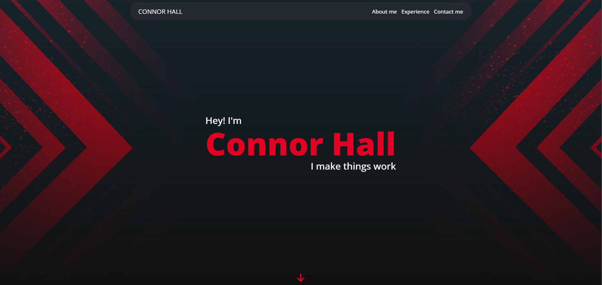

## My Portfolio

The page has a header with functional buttons that take you to the various
sections. It has an about section with a picture of yours truly and some 
info about me, a small section showing what I'm experienced with, and finally
a contact section with links to my email, GitHub, and Linkedin. The Linkedin
button doesn't work because I haven't made an account yet but that will
be fixed soon.

This is first time I made something that felt like it had an actual purpose 
rather than just being for an assignment or practice. It's the product of 
everything I've learned so far and I'm very happy with how it turned out.
Beyond using what I've know I also learned various tecniques while working
on this. One example being the gradient behind the language icons in the
experience section.

